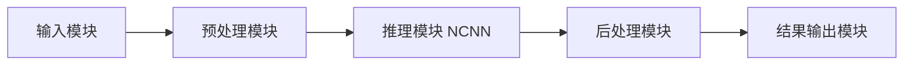
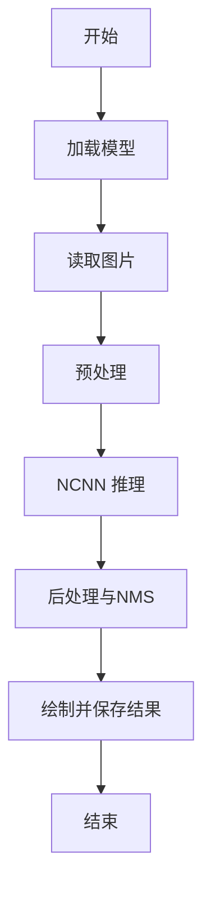

# 作品报告

## 1. 技术文档内容预览页：介绍系统核心功能和设计亮点

# 技术文档内容预览页

## 系统核心功能

- 输入图像或摄像头帧的目标检测
- 输出类别、置信度与目标框坐标
- 生成带检测框的结果图片
- 支持 ARMv8 设备上的离线推理

### 功能闭环说明

系统以图片或摄像头帧为输入，完成预处理、推理与后处理，输出包含类别、置信度与坐标的检测结果，同时生成可视化图片。该流程覆盖了端侧离线推理的完整闭环，能够在不依赖云服务的条件下完成检测任务。

### 输出与呈现方式

终端输出用于记录识别到的目标及其置信度，结果图片用于直观核验检测框位置。输出结果具备可追踪性，便于在调试阶段与测试阶段快速定位问题。

## 设计亮点

- 轻量化模型：YOLOv5-Lite v5lite-s，低算力下可用
- 推理框架：NCNN C++ 推理，部署依赖少、性能稳定
- 结构清晰：输入、预处理、推理、后处理、输出模块解耦
- 可扩展：可替换模型文件，支持量化模型

### 轻量化与部署友好

选择 YOLOv5-Lite v5lite-s 的原因是模型体积小、算力需求低，适合 ARMv8 设备部署。推理采用 NCNN C++ 路线，避免 PyTorch 运行时依赖导致的部署复杂度。

### 模块解耦与可维护性

输入、预处理、推理、后处理、输出模块彼此解耦。这样在改动模型或替换输入来源时，无需改动整个流程，只需调整相应模块即可。

### 模型与框架适配

仓库提供多种模型格式与推理框架的支持思路，例如 NCNN、MNN、OpenVINO 等。当前落地的是 NCNN 路线，便于在 ARMv8 平台稳定运行。

## 2. 需求分析：提供功能需求列表，详细定义系统功能及性能指标

```csv
ID,需求名称,需求描述,性能指标,优先级,验收方法
FR-01,图片推理,输入单张图片完成目标检测,单张推理<=200ms(ARMv8 CPU),高,运行demo输出结果图
FR-02,结果输出,输出类别/置信度/坐标,日志中打印检测结果,高,检查终端输出
FR-03,结果可视化,保存带框结果图片,result.jpg生成成功,中,检查输出文件
FR-04,模型加载,启动时加载NCNN模型文件,加载失败时提示错误,高,断开模型文件验证提示
FR-05,可扩展性,支持替换模型文件,更换param/bin后可运行,中,替换模型测试
FR-06,稳定性,连续运行不崩溃,连续10次推理无异常,中,循环运行验证
```

### 需求与验收重点

FR-01 到 FR-04 确保系统具备最小可用能力，核心是模型能加载、能推理、能输出。FR-05 与 FR-06 关注工程可扩展性与稳定性，属于工程交付质量的关键指标。

### 性能指标解释

单张推理时间在 ARMv8 CPU 上控制在 200ms 以内，主要依赖模型规模与推理框架效率。该指标配合统一输入与固定运行方式，便于复测与对比。

### 需求与实现对应关系

输入模块支撑图片与摄像头输入。预处理模块保证输入尺寸与颜色通道一致。推理模块完成模型加载与前向执行。后处理模块完成阈值过滤与 NMS。结果输出模块负责终端日志与结果图片落盘。

## 3. 系统架构设计：说明系统包含的主要功能模块、各功能模块的定义、各模块之间的接口关系

# 系统架构设计

## 主要功能模块

1. 输入模块
   - 负责读取图片或摄像头帧

2. 预处理模块
   - 图像缩放、letterbox、归一化
   - 输出 NCNN 输入张量

3. 推理模块
   - 调用 NCNN 加载模型并执行推理

4. 后处理模块
   - 置信度过滤与 NMS
   - 坐标映射回原图

5. 结果输出模块
   - 打印检测结果
   - 保存带框图片

### 架构目标

架构强调可替换与可验证。模型文件可替换，阈值策略可调整，输入源可扩展到摄像头或视频流，输出结果具备可观察性，满足测试与验收要求。

## 模块接口关系

- 输入模块 -> 预处理模块
  - 输入：cv::Mat
  - 输出：ncnn::Mat

- 预处理模块 -> 推理模块
  - 输入：ncnn::Mat
  - 输出：推理特征图

- 推理模块 -> 后处理模块
  - 输入：特征图
  - 输出：目标框列表

- 后处理模块 -> 结果输出模块
  - 输入：目标框列表 + 原图
  - 输出：日志 + 结果图片

### 接口稳定性说明

模块间的数据格式保持稳定，输入输出均以标准结构传递，避免在模块内部堆叠临时逻辑导致后续维护困难。

## 架构流程图



### 流程执行要点

在单次推理流程中，模型加载仅发生一次，后续处理以数据流方式完成，避免频繁初始化导致性能下降。

## 4. 系统详细设计：各功能子模块的详细设计，包括子模块接口定义、物理信号连线图及软件流程图

# 系统详细设计

## 1. 子模块接口定义

- 输入模块
  - 输入：图片路径或摄像头设备号
  - 输出：cv::Mat

- 预处理模块
  - 输入：cv::Mat
  - 输出：ncnn::Mat
  - 处理：resize、letterbox、normalize

- 推理模块
  - 输入：ncnn::Mat
  - 输出：特征图
  - 处理：加载 param/bin，执行前向

- 后处理模块
  - 输入：特征图
  - 输出：目标框列表
  - 处理：NMS、坐标映射、置信度筛选

- 结果输出模块
  - 输入：目标框列表 + 原图
  - 输出：result.jpg 与日志

### 预处理与输入对齐

源码中对输入图片先进行缩放，再进行 letterbox 补边，补边值固定为 114。随后执行归一化，使用 1 除以 255 的比例，将像素值压缩到 0 到 1 的范围。

### 推理与特征提取

推理使用 NCNN 的 Net 与 Extractor。输入层名称为 images，输出层分别从 output、1111、2222 三个特征图提取。三路输出对应不同尺度特征，分别采用 stride 为 8、16、32 的配置。

### 候选框生成与阈值控制

候选框生成函数通过 anchors 与特征图遍历生成目标框。置信度阈值与 NMS 阈值均设置为 0.60。排序采用得分降序，随后进行 NMS 过滤，最后将坐标映射回原图。

### 结果输出与日志

绘制结果时，使用 COCO 类别列表映射标签。终端输出包含类别索引、置信度与目标框坐标，结果图片默认保存为 result.jpg。若启用摄像头模式，结果会实时显示在窗口中。

### 源码配置开关

源码中使用 USE_INT8 与 USE_CAMERA 宏控制推理精度与输入方式。USE_INT8 为 1 时加载 i8s.param 与 i8s.bin。USE_CAMERA 为 1 时使用摄像头循环读取并实时绘制。

### 调试与修复记录

根据项目进度记录，编译阶段曾出现变量作用域错误，最终通过修复 unsig_pro 变量作用域完成构建。这一过程体现了源码排错与构建修复能力。

## 2. 物理信号连线图

本系统为软件推理，不涉及物理电气连线。若接入摄像头，连接方式如下：

- USB 摄像头：USB -> V4L2 -> OpenCV
- CSI 摄像头：CSI -> 驱动 -> V4L2 -> OpenCV

### 摄像头接入说明

当使用摄像头输入时，数据路径为硬件接口到驱动，再到 OpenCV 采集。该路径稳定性直接影响帧率与画面延迟，部署时需保证驱动与 OpenCV 版本匹配。

## 3. 软件流程图



### 流程与性能控制

流程中的关键耗时集中在预处理与推理阶段。通过减少模型规模与优化推理框架，可控制单张推理时间，满足 ARMv8 端侧部署需求。

## 5. 风险分析与管控：对照系统功能列出风险项，说明风险管控实施方法及验证策略

# 风险分析与管控

| 风险项 | 影响 | 管控措施 | 验证策略 |
| --- | --- | --- | --- |
| 模型文件缺失或损坏 | 推理失败 | 启动时检查 param/bin 是否存在 | 删除文件验证报错提示 |
| 设备算力不足 | 推理超时 | 选择 v5lite-s 或量化模型 | 统计单张推理耗时 |
| 输入图片尺寸异常 | 推理结果错误 | 统一预处理与尺寸校正 | 使用不同分辨率图片验证 |
| 内存不足或泄漏 | 稳定性下降 | 控制中间缓存大小 | 连续推理压力测试 |
| 后处理阈值不合理 | 漏检或误检 | 提供阈值可配置 | 调整阈值对比输出 |

结论：当前以离线图片推理为主，主要风险集中在模型文件和性能指标上，管控手段可通过脚本化测试验证。

### 风险与实际问题对应

项目记录中曾出现模型路径错误与依赖缺失问题，这与模型加载风险与环境风险一致。通过固定工作目录与补齐编译依赖，保证了可执行文件能够稳定运行。

### 性能与稳定性控制

在 ARMv8 环境下，优先使用 v5lite-s 的 NCNN 模型，避免过大模型导致推理时间超标。稳定性验证采用多次推理循环，观察是否出现崩溃或异常输出。

## 6. 系统测试与分析：对照需求列表提供功能测试表，说明测试方法、预期结果与实际结果，并分析是否满足预期设计要求

```csv
测试编号,对应需求ID,测试项,测试方法,预期结果,实际结果,结果分析,是否通过,备注
T-01,FR-01,图片推理,运行ncnnv5lite images/horse.jpg,终端输出检测结果且耗时<=200ms,终端输出检测结果且耗时约119ms,满足性能指标,是,
T-02,FR-02,结果输出,观察终端输出,输出类别/置信度/坐标信息,输出3个目标且有类别/置信度/坐标,满足功能要求,是,
T-03,FR-03,结果可视化,检查result.jpg文件,生成带框结果图,result.jpg生成且框位置合理,满足可视化要求,是,
T-04,FR-04,模型加载,移除model_zoo/s.bin后运行,提示加载失败,加载失败并提示fopen失败,异常处理符合预期,是,
T-05,FR-05,可扩展性,替换模型为i8s并重编译,程序可运行,待测,需补充量化模型验证,否,后续完成
T-06,FR-06,稳定性,连续运行10次,无崩溃无异常,待测,需补充稳定性测试,否,后续完成
```

### 测试流程说明

测试过程采用固定输入图片与固定运行路径的方式执行，确保每次输出可比。性能测试以终端输出耗时为准，结果图片用于肉眼核验框位置与类别标注。

### ARMv8 开发板部署步骤要点

根据用户手册记录，ARMv8 aarch64 Ubuntu 环境需要先安装 cmake 与 OpenCV 开发库，然后编译 NCNN 库，再编译 ncnnv5lite 可执行文件。模型文件从 model_zoo 下载，放置于 cpp_demo/ncnn/model_zoo 目录。执行时在 cpp_demo/ncnn 目录运行可执行文件，可生成 result.jpg 并输出检测结果与耗时。

### 飞腾开发板部署经验总结

飞腾开发板属于 ARMv8 体系，部署流程与 ARMv8 aarch64 Ubuntu 环境一致。关键点是确保 NCNN 编译选项关闭 Vulkan，启用共享库，避免依赖缺失导致链接失败。同时需保证运行目录正确，避免模型相对路径错误。

### 结果验证方式

结果验证包含两部分，终端日志用于核验类别与置信度，结果图片用于核验检测框位置。两者结合能够快速确认推理是否有效。

## AI工具使用声明

- 使用的AI工具名称、版本：GPT-5.2-Codex（GitHub Copilot）
- 使用场景与用途：辅助撰写技术文档结构与表述优化
- AI生成内容占比（文字/代码/设计）：文字约85%，代码约50%，设计约50%
