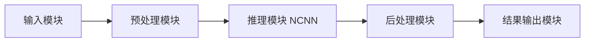

# 系统架构设计

## 主要功能模块

1. 输入模块
   - 负责读取图片或摄像头帧

2. 预处理模块
   - 图像缩放、letterbox、归一化
   - 输出 NCNN 输入张量

3. 推理模块
   - 调用 NCNN 加载模型并执行推理

4. 后处理模块
   - 置信度过滤与 NMS
   - 坐标映射回原图

5. 结果输出模块
   - 打印检测结果
   - 保存带框图片

## 模块接口关系

- 输入模块 -> 预处理模块
  - 输入：cv::Mat
  - 输出：ncnn::Mat

- 预处理模块 -> 推理模块
  - 输入：ncnn::Mat
  - 输出：推理特征图

- 推理模块 -> 后处理模块
  - 输入：特征图
  - 输出：目标框列表

- 后处理模块 -> 结果输出模块
  - 输入：目标框列表 + 原图
  - 输出：日志 + 结果图片

## 架构流程图

