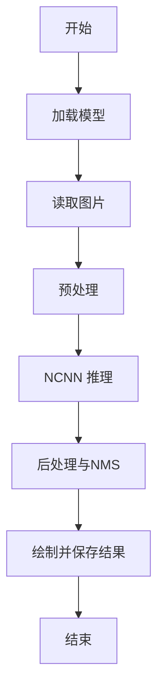

# 系统详细设计

## 1. 子模块接口定义

- 输入模块
  - 输入：图片路径或摄像头设备号
  - 输出：cv::Mat

- 预处理模块
  - 输入：cv::Mat
  - 输出：ncnn::Mat
  - 处理：resize、letterbox、normalize

- 推理模块
  - 输入：ncnn::Mat
  - 输出：特征图
  - 处理：加载 param/bin，执行前向

- 后处理模块
  - 输入：特征图
  - 输出：目标框列表
  - 处理：NMS、坐标映射、置信度筛选

- 结果输出模块
  - 输入：目标框列表 + 原图
  - 输出：result.jpg 与日志

## 2. 物理信号连线图

本系统为软件推理，不涉及物理电气连线。若接入摄像头，连接方式如下：

- USB 摄像头：USB -> V4L2 -> OpenCV
- CSI 摄像头：CSI -> 驱动 -> V4L2 -> OpenCV

## 3. 软件流程图

